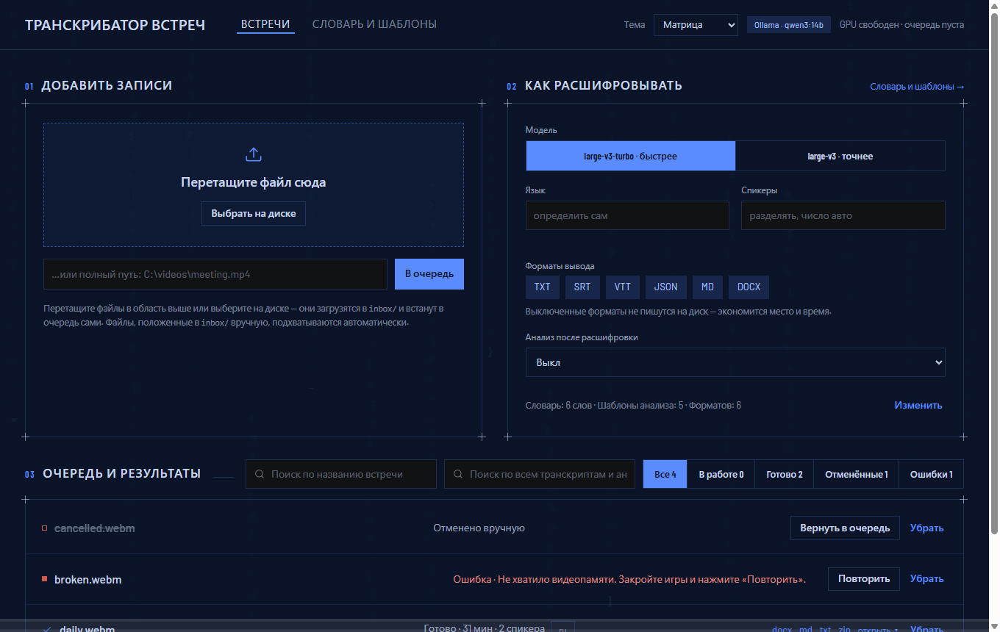
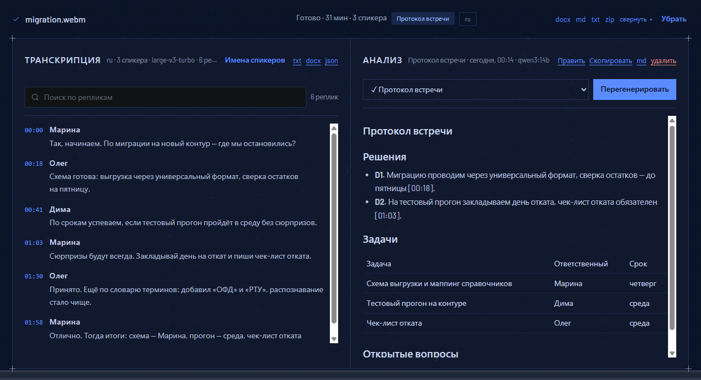
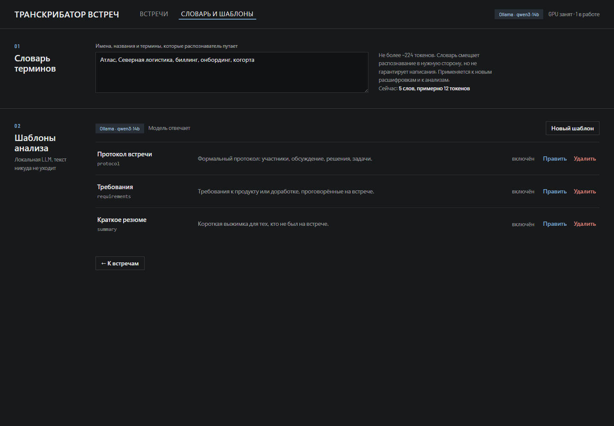

# Meeting Transcriber

[](https://github.com/Romandredan/meeting-transcriber/actions/workflows/ci.yml)
[](https://github.com/Romandredan/meeting-transcriber/releases)
[](https://github.com/Romandredan/meeting-transcriber/commits/main)
[](LICENSE)
[](https://www.python.org/)


[](https://agents.md)

**Локальный транскрибатор записей встреч.** Видео/аудиофайл → диаризованная (с разметкой спикеров) транскрипция с таймкодами в TXT/SRT/VTT/JSON/MD/DOCX → опциональный анализ транскрипта локальной LLM (протокол, задачи, требования, резюме). Всё считается на вашей машине: ни аудио, ни текст никуда не отправляются.

> **English.** Meeting Transcriber is a fully local, self-hosted meeting-recording pipeline for Windows + NVIDIA GPU. It watches a folder for video/audio files, transcribes them with faster-whisper, applies pyannote speaker diarization, and writes timestamped transcripts in six formats. An optional stage feeds the transcript to a local LLM via Ollama to produce meeting minutes, action items or summaries from editable prompt templates. Nothing leaves the machine — no cloud APIs, no telemetry. The web UI and all documentation are in Russian.

## Интерфейс

**Главная страница** — добавление записей, настройки распознавания и очередь:



**Карточка встречи** — транскрипция с разметкой спикеров и результат анализа локальной LLM:



**Словарь и шаблоны** — словарь терминов и редактируемые шаблоны анализа:



---

## Возможности

- **Папка-приёмник.** Любой видео/аудиофайл, попавший в `inbox/`, автоматически уходит в очередь. Программа ждёт, пока файл перестанет дописываться, — недокачанный или ещё пишущийся стрим в работу не возьмётся.
- **Загрузка из браузера.** Drag & drop, выбор файла на диске или указание полного пути.
- **Диаризация.** Разметка «Спикер 1 / Спикер 2» через pyannote; число спикеров можно задать вручную или оставить автоопределение.
- **Шесть форматов вывода:** `txt`, `srt`, `vtt`, `json`, `md`, `docx` — набор выбирается в интерфейсе.
- **Настройки на встречу:** модель (`large-v3-turbo` — быстрее, `large-v3` — точнее), язык (или автоопределение), количество спикеров.
- **Словарь терминов.** Список специфичных слов (названия систем, фамилии, аббревиатуры) подсказывается модели, чтобы она их не коверкала.
- **Анализ локальной LLM** (опционально): готовая расшифровка превращается в протокол/требования/резюме по редактируемым шаблонам промптов. Работает через Ollama, по умолчанию `qwen3:14b`.
- **Управление очередью:** отмена выполняющейся встречи, повтор после ошибки, удаление из списка (с результатами или без).
- **Живой прогресс** — SSE-поток в веб-интерфейс: стадия, проценты, ошибки.
- **Автозапуск и супервизор.** Задача Планировщика «при входе в Windows»; упавший сервер поднимается сам, с защитой от зацикливания и ротацией логов.
- **Освобождение видеопамяти при простое** — модели выгружаются из VRAM, когда очереди пусты.
- **Диагностика в один клик** — zip-архив с версиями, состоянием GPU/Ollama и логами (без секретов) для разбора проблемы.

## Требования

| Компонент | Требование |
| --- | --- |
| **ОС** | Windows 10/11. Скрипты установки и автозапуска — PowerShell, других ОС проект не поддерживает. |
| **GPU** | NVIDIA с поддержкой сборки PyTorch **cu128** (относительно свежая карта и драйвер). Без GPU всё работает на CPU — значительно медленнее. |
| **VRAM** | ~8 ГБ — транскрипция. **16 ГБ** — транскрипция + анализ на `qwen3:14b` рядом с Whisper. Меньше 16 ГБ: поставьте `LLM_NUM_CTX=16384`, модель полегче в `LLM_MODEL` или откажитесь от анализа (`ANALYZE_ENABLED=false`). |
| **Диск** | ≈20 ГБ с анализом, ≈8 ГБ без него (модели Whisper и LLM). |
| **Python** | 3.10–3.13 — установщик поставит сам, если не найдёт. |
| **ffmpeg** | ставится установщиком (winget, при его отсутствии — прямое скачивание). |
| **HuggingFace-токен** | нужен **только для диаризации**: примите условия [`pyannote/speaker-diarization-community-1`](https://huggingface.co/pyannote/speaker-diarization-community-1) тем же аккаунтом, что выдал токен. Без токена транскрипция работает, разметка спикеров просто пропускается. |
| **Ollama** | нужна только для стадии анализа; установщик ставит её и скачивает модель сам. |

## Быстрый старт (Windows)

```powershell
git clone https://github.com/Romandredan/meeting-transcriber.git
cd meeting-transcriber
```

Дальше — **двойной клик по `Установить.bat`**. Всё остальное происходит само:

- проверяется место на диске;
- ставятся Python 3.10–3.13 и ffmpeg (winget; без winget — прямое скачивание с python.org / gyan.dev);
- определяется видеокарта и ставится подходящая сборка PyTorch (cu128 или CPU);
- ставится Ollama, скачивается модель анализа (`ollama pull qwen3:14b`), демону выставляются `OLLAMA_FLASH_ATTENTION=1` и `OLLAMA_KV_CACHE_TYPE=q8_0`;
- скачивается модель распознавания Whisper (≈3 ГБ, один раз);
- предлагается вставить `HF_TOKEN` для диаризации (можно пропустить);
- настраивается автозапуск при входе в Windows, сервер стартует сразу.

Затем откройте **<http://127.0.0.1:8473>** (порт меняется в `.env` → `APP_PORT`).

Установка **идемпотентна**: при сбое достаточно запустить `Установить.bat` ещё раз — всё уже готовое будет пропущено. Текст ошибки и `logs\install.log` пригодятся, если придётся заводить issue.

### Батники в корне проекта

| Файл | Что делает |
| --- | --- |
| `Установить.bat` | установка / переустановка |
| `Запустить.bat` | ручной запуск сервера (если автозапуск выключен) |
| `Обновить.bat` | `git pull`, доустановка зависимостей, перезапуск. Данные (`.env`, `data.db`, `inbox/`, `output/`, `processed/`, `models/`) не трогаются |
| `Диагностика.bat` | собирает `logs\diag-<дата>.zip`: версии, GPU, Ollama, статус сервера, логи, ошибки встреч. Секреты не включаются — фиксируется только факт «`HF_TOKEN` задан» |

### Установка из PowerShell (без вопросов)

```powershell
.\install.ps1 -Autostart      # с автозапуском
.\install.ps1 -NoAutostart    # без автозапуска
.\install.ps1 -SkipOllama     # не ставить Ollama (анализ не нужен)
```

<details>
<summary>Ручная установка (если скрипт не подошёл)</summary>

```powershell
py -3.12 -m venv .venv
.venv\Scripts\pip install --upgrade pip
.venv\Scripts\pip install torch torchaudio --index-url https://download.pytorch.org/whl/cu128
.venv\Scripts\pip install -r requirements-ml.txt -r requirements-base.txt
copy .env.example .env
.\run.ps1
```

`torch` ставится **отдельной командой до** `requirements-ml.txt` — иначе подтянется CPU-сборка с PyPI.
</details>

## Как это работает

```text
inbox/ ──watcher──> очередь (SQLite) ──worker──> ffmpeg ─> Whisper ─> pyannote ─> output/<job_id>/*.{txt,srt,vtt,json,md,docx}
                                                                                        │
                                                                   исходник ─> processed/│
                                                                                        ▼
                                                              (по кнопке) анализ LLM ─> протокол/резюме .md
```

1. **Watcher** следит за `inbox/` и ждёт, пока файл перестанет меняться (`INBOX_QUIET_SECONDS`).
2. Появляется запись в очереди; **worker** забирает задачи по одной, FIFO.
3. `ffmpeg` извлекает WAV → распознавание (faster-whisper) → диаризация (pyannote, если есть токен) → склейка реплик в абзацы → запись всех выбранных форматов в `output/<job_id>/`.
4. Исходник уезжает в `processed/` (отключается через `MOVE_PROCESSED=false`).
5. Готовую встречу можно отправить на **анализ** — отдельная очередь, тот же единственный worker.

Приложение — **один процесс**: FastAPI + фоновый worker-поток + watcher. Всё, что занимает GPU, выполняется этим единственным потоком, поэтому расшифровки и анализы **никогда не конкурируют за видеопамять**. SQLite (`data.db`) служит и очередью, и источником истины: результаты сначала попадают в базу, запись файлов на диск — best-effort.

Движки транскрипции: **faster-whisper (CTranslate2)** — основной; PyTorch-native **transformers** — экспериментальный fallback, для надёжной работы рекомендуется NVIDIA GPU.

## Анализ транскрипта локальной LLM

Готовую расшифровку можно превратить в протокол, список требований или краткое резюме — локально, без отправки текста наружу. **Установщик ставит Ollama и скачивает модель сам** (`qwen3:14b` по умолчанию, меняется в `.env` → `LLM_MODEL`); заодно он выставляет демону `OLLAMA_FLASH_ATTENTION=1` и `OLLAMA_KV_CACHE_TYPE=q8_0` — без них KV-кэш ест вдвое больше VRAM и окно 32k не влезает в 16 ГБ. Если Ollama была установлена раньше, переменные подхватятся после её перезапуска (или перезагрузки).

- Запуск — кнопкой **«Анализ»** в карточке готовой встречи, с выбором шаблона.
- Шаблоны редактируются в разделе **«Словарь и шаблоны»** веб-интерфейса.
- Длинные встречи обрабатываются **map-reduce**: транскрипт режется на перекрывающиеся куски, результаты сворачиваются рекурсивно.
- Каждый анализ хранит **снимок промпта** на момент запуска — правка шаблона не переписывает историю.
- Выключить фичу целиком: `ANALYZE_ENABLED=false` (тогда Ollama не нужна; у установщика есть флаг `-SkipOllama`).

Если модель не влезла в VRAM целиком — это **не ошибка**: Ollama досчитает часть слоёв на процессоре, анализ просто пойдёт медленнее. Предупреждение об этом появится рядом с кнопкой «Анализ».

## Автозапуск и устойчивость к сбоям

- Автозапуск — задача Планировщика «при входе» (настраивается установщиком; вручную: `register-autostart.ps1` / `unregister-autostart.ps1`). Задача работает **в пользовательской сессии** — это нужно для доступа к GPU.
- `autostart.ps1` — **супервизор**: сервер упал → перезапуск. Защита от зацикливания: 5 падений за 10 минут → попытки прекращаются с понятной записью в лог. Второй экземпляр не плодится (проверка порта).
- Логи не затираются: прежние `logs\server.out.log` / `server.err.log` переименовываются с номером (хранится 5 поколений).
- Перезапуск после сбоя: перезагрузка, `Запустить.bat` или `Start-ScheduledTask MeetingTranscriber`.

## Освобождение видеопамяти при простое

Программа работает в фоне и стартует вместе с Windows — между встречами она может простаивать часами, а модель Whisper всё это время держит несколько гигабайт VRAM занятыми, даже если стадией анализа вы не пользуетесь. По умолчанию через `IDLE_UNLOAD_SECONDS=300` (5 минут) простоя без расшифровок и анализов в очереди все модели выгружаются из видеокарты.

Следующая расшифровка после выгрузки начнётся с повторной загрузки модели — это единицы секунд, но на каждый файл, поэтому не ставьте значение слишком маленьким. `0` — не выгружать вовсе.

## Настройки

Все настройки живут в `.env` (создаётся из [`.env.example`](.env.example) при установке). **`.env.example` — основная документация настроек**: каждая переменная там описана подробно, с последствиями изменения. Ниже — те, что меняют чаще всего.

| Переменная | По умолчанию | Назначение |
| --- | --- | --- |
| `HF_TOKEN` | — | токен HuggingFace; нужен только для диаризации |
| `APP_HOST` / `APP_PORT` | `127.0.0.1` / `8473` | адрес веб-интерфейса. `0.0.0.0` открывает доступ из локальной сети |
| `INBOX_DIR` | `inbox/` | отслеживаемая папка с записями |
| `OUTPUT_DIR` | `output/` | куда складывать результаты |
| `PROCESSED_DIR` | `processed/` | куда убирать обработанные исходники |
| `MOVE_PROCESSED` | `true` | переносить ли исходник после обработки |
| `INBOX_QUIET_SECONDS` | `90` | сколько секунд файл должен «полежать без изменений», прежде чем его возьмут в работу |
| `INBOX_POLL_SECONDS` | `30` | как часто проверять, не изменился ли файл в `inbox/` |
| `WHISPER_MODEL` | `large-v3-turbo` | модель распознавания по умолчанию |
| `MERGE_MAX_SECONDS` | `90` | максимальная длина склеенной реплики в TXT/MD/DOCX |
| `ANALYZE_ENABLED` | `true` | включает стадию анализа LLM |
| `LLM_MODEL` / `LLM_NUM_CTX` | `qwen3:14b` / `32768` | модель анализа и окно контекста |
| `IDLE_UNLOAD_SECONDS` | `300` | простой до выгрузки моделей из VRAM; `0` — не выгружать |

## REST API

Сервер отдаёт не только веб-интерфейс, но и HTTP-API — удобно, если хочется дёргать транскрипцию из своих скриптов. База: `http://127.0.0.1:8473`.

| Метод и путь | Что делает |
| --- | --- |
| `POST /api/jobs` | поставить в очередь файл по полному пути |
| `POST /api/jobs/upload?filename=…` | загрузить файл телом запроса (drag & drop в UI) |
| `GET /api/jobs` | список встреч |
| `GET /api/jobs/{id}` | одна встреча |
| `POST /api/jobs/{id}/cancel` | снять с очереди / попросить worker остановиться |
| `POST /api/jobs/{id}/requeue` | повторить после ошибки или отмены |
| `DELETE /api/jobs/{id}?purge=true` | удалить из списка (`purge` — вместе с папкой результатов) |
| `GET /api/jobs/{id}/transcript` | расшифровка для панели предпросмотра |
| `GET /api/jobs/{id}/files` | какие форматы реально лежат на диске |
| `GET /api/jobs/{id}/download/{fmt}` | скачать один формат (`txt`/`srt`/`vtt`/`json`/`md`/`docx`) |
| `GET /api/jobs/{id}/download_zip` | скачать все форматы архивом |
| `GET` / `PUT /api/settings` | текущие настройки распознавания (модель, язык, спикеры, словарь) |
| `GET /api/events` | **SSE**-поток прогресса и событий очереди |
| `GET /api/llm/health` | доступна ли Ollama и загружена ли модель |
| `GET` / `POST /api/templates`, `PUT` / `DELETE /api/templates/{id}` | CRUD шаблонов анализа¹ |
| `POST` / `GET /api/jobs/{id}/analyses` | запустить анализ / список анализов встречи¹ |
| `GET /api/analyses/{id}/download` | скачать результат анализа (`.md`)¹ |
| `DELETE /api/analyses/{id}` | удалить анализ¹ |

¹ роуты регистрируются только при `ANALYZE_ENABLED=true`.

Интерактивная схема — например, на `http://127.0.0.1:8473/docs` (Swagger UI от FastAPI).

## Разработка

```powershell
# Все тесты (GPU, сеть и Ollama не нужны — внешнее подменяется фейками)
.venv\Scripts\python -m pytest -q

# Один файл / один тест
.venv\Scripts\python -m pytest tests/test_worker.py -q
.venv\Scripts\python -m pytest tests/test_analyze.py -k chunk -q

# Запуск (порт опционально; по умолчанию APP_PORT из .env)
.\run.ps1
.\run.ps1 9000
```

Стек: **FastAPI + uvicorn**, **faster-whisper/CTranslate2**, **pyannote.audio 4.x**, **Ollama**, stdlib `sqlite3` и `urllib`, фронтенд — **vanilla JS без сборки**. Новые зависимости добавляются неохотно: сначала проверяется, нет ли решения на stdlib.

Разработка ведётся через TDD — на каждый модуль `app/X.py` есть `tests/test_X.py`. Линтер и CI не настроены, проверка — локальный прогон pytest. Подробное описание архитектуры и соглашений для контрибьюторов (и AI-агентов) — в [AGENTS.md](AGENTS.md).

Структура: `app/` — бэкенд (`app/engine/` — движки транскрипции), `web/` — фронтенд, `tests/` — тесты, `scripts/` — вспомогательные скрипты, `*.ps1` и `*.bat` в корне — установка, запуск, автозапуск, обновление, диагностика.

## Ограничения

- **Только Windows.** Установка, автозапуск и супервизор построены на PowerShell и Планировщике заданий.
- **Ориентация на NVIDIA/CUDA.** На CPU всё работает, но существенно медленнее; transformers-движок — экспериментальный fallback.
- **Один worker.** Встречи обрабатываются строго по очереди — это осознанное решение ради сериализации доступа к GPU, а не недоработка.
- **Интерфейс и документация — на русском.** Распознавание при этом мультиязычное (Whisper), язык задаётся на встречу или определяется автоматически.
- **Нет CI для тестов и линтера.** Единственный GitHub Actions workflow — создание релиза с zip-архивом при пуше тега `v*`.

## Приватность

Всё считается локально: аудио, транскрипты и результаты анализа не покидают машину. Сеть нужна только при установке (скачивание Python/ffmpeg/моделей) и при первом обращении к моделям HuggingFace. По умолчанию сервер слушает `127.0.0.1` — только этот компьютер; `APP_HOST=0.0.0.0` открывает доступ из локальной сети и является осознанным выбором пользователя. `.env` с токеном не коммитится и не попадает в диагностический архив.

## Поддержка и вклад

Вопросы, баги и предложения — в [Issues](https://github.com/Romandredan/meeting-transcriber/issues). К отчёту о проблеме приложите `logs\diag-<дата>.zip` (собирается `Диагностика.bat`) — в нём нет секретов, только версии, состояние GPU/Ollama и логи.

Pull request'ы приветствуются. Перед отправкой прогоните тесты и загляните в [AGENTS.md](AGENTS.md) — там описаны архитектурные инварианты, которые легко сломать не зная о них (порядок выгрузки моделей из VRAM, «БД — источник истины», снимок промпта, сохранение состояния UI при автообновлении).

## Лицензия

[MIT](LICENSE)
